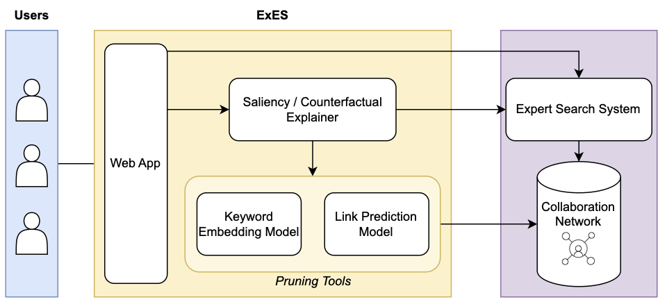

# ExES
This package provides a framework for explaining Expert Search and Team Formation systems.


# How to run
ExES is built using Python 3.10. To operate ExES, first of all, create a virtual environment and install the dependencies.

```bash
virtualenv venv
source venv/bin/activate
pip install -r requirements.txt
```

## Data
Fetch the data from [here](https://vault.cs.uwaterloo.ca/s/K3gWAdGb7NBF3JL), and unzip it in the `data` directory.

## Preprocessing
The data preprocessing pipelines are in the `preprocessing` directory. First, run the notebooks in the `Graph_Creation` subdirectory to run the data cleaning processes and generate the collaboration networks. To train the expert ranking models using the collaboration networks and preprocessed data, run the notebooks in the `train` subdirectory.

## Models
The pretrained black-box models, used in our demonstration and experiments could be fetched from [here](https://vault.cs.uwaterloo.ca/s/M2yomPngLQwkmgc). Extract the models zip file in the `model` directory, or train them from scratch, through the preprocessing pipeline.

## Backend
ExES uses Flask as the backend framework. The code for the core functionality of ExES is included in the `src` directory. To serve the backend server:
```bash
cd src
python server.py 
```

## Frontend
ExES is equipped with frontend web app, developed using the Vue.js framework. The frontend code is in the `frontend` folder. First, you should have Node.js and npm installed. Then, install the dependencies:
```bash
cd frontend
npm i
```
To serve the frontend, first build the app for production:
```bash
npm run build
```
Then, serve it using Python http.server:
```bash
cd dist
python -m http.server --bind 0.0.0.0 8091
```